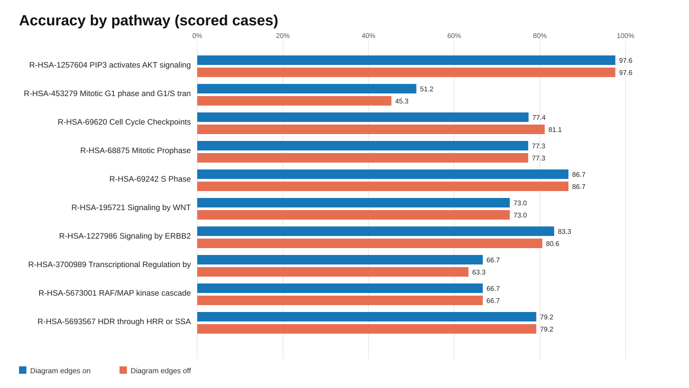

# DeltaSignal Evaluation Report

## Executive Result

This report evaluates current DeltaSignal with SCC solving on 847 experimentally
supported MP-BioPath cases across ten Reactome pathways. Three pathways were
used during development and seven were locked as held out. Exact key-output
entities are the primary endpoint; reaction proxies remain disabled.

With Reactome v97 diagram edges enabled, DeltaSignal scored
**627/847** cases and was
correct on **456/627**
(72.7%). With diagram edges disabled it was
correct on **444/627**
(70.8%). Coverage-adjusted accuracy was
53.8% versus
52.4%.

On the seven held-out pathways, diagram-on accuracy was
**289/404**
(71.5%) versus
**280/404**
(69.3%) diagram-off. Across the
627 paired scored cases, diagram edges changed 25
classifications: 16 changed wrong-to-correct and 4
correct-to-wrong (exact McNemar p = 0.01182). This is evidence that
diagram topology contributes useful signal, but it is not evidence that a
DeltaSignal internal change caused the gain.

## Convergence Gate

The ten-pathway run exposed a generalization issue that was invisible in the
three-pathway development panel. Diagram-on reported
133 non-converged scored cases, but these repeat
only **9 of
171** unique perturbation solves. Diagram-off
reported 147 cases from
**11 of
171** unique solves. All failures are in
Transcriptional Regulation by TP53. Non-converged outputs must not be treated
as equally reliable evidence; the report preserves them for diagnosis and
reports convergence explicitly.

Among converged diagram-on cases, accuracy was
340/494
(68.8%); for diagram-off it was
326/480
(67.9%). The non-converged
diagram-on TP53 cases were correct on
116/133
(87.2%), so the headline accuracy
is partly supported by numerically unstable outputs and should not be reported
without this qualification.

## Coverage And Failure Attribution

Exact-output coverage was 74.0%. Unscored
cases were not converted to unchanged predictions. Recorded reasons were:
key_output_proxy_available_not_enabled: 192, gene_dbids_present_in_reactome_but_not_exported: 25, key_output_absent_from_reactome_release: 3.

This separation matters: scored-case accuracy describes behavior where the
requested perturbation and output exist in the graph; coverage-adjusted
accuracy describes the end-to-end system over all eligible cases.

## Pathway-Level Result

| Pathway | Split | Scored / eligible | Diagram on | Diagram off | Net correct |
| --- | --- | ---: | ---: | ---: | ---: |
| PIP3 activates AKT signaling | development | 84/200 | 97.6% | 97.6% | +0 |
| Mitotic G1 phase and G1/S transition | development | 86/89 | 51.2% | 45.3% | +5 |
| Cell Cycle Checkpoints | development | 53/55 | 77.4% | 81.1% | -2 |
| Mitotic Prophase | held_out | 22/26 | 77.3% | 77.3% | +0 |
| S Phase | held_out | 15/25 | 86.7% | 86.7% | +0 |
| Signaling by WNT | held_out | 37/49 | 73.0% | 73.0% | +0 |
| Signaling by ERBB2 | held_out | 36/49 | 83.3% | 80.6% | +1 |
| Transcriptional Regulation by TP53 | held_out | 240/257 | 66.7% | 63.3% | +8 |
| RAF/MAP kinase cascade | held_out | 6/49 | 66.7% | 66.7% | +0 |
| HDR through HRR or SSA | held_out | 48/48 | 79.2% | 79.2% | +0 |

## Comparator Context

On the 627 cases scored by diagram-on DeltaSignal,
MP-BioPath was correct on 452
(72.1%) and the
curator predictions on 481
(76.7%). The
paired bootstrap interval versus MP-BioPath was
[-2.7,
3.5]
percentage points. The result supports approximate paired performance, not a
statistically established win. MP-BioPath and curator predictions cover all
847 eligible cases, while exact-output DeltaSignal covers
627.

## TCGA LUAD External Association Layer

| Pathway | Samples | Mapped roots | Log-rank p | Shuffle fraction <= observed |
| --- | ---: | ---: | ---: | ---: |
| PIP3 activates AKT signaling | 502 | 1504 | 0.578 | 0.567 |
| Mitotic G1-G1 S phases | 502 | 427 | 0.0555 | 0.048 |
| Cell Cycle Checkpoints | 502 | 6552 | 8.92e-05 | 0 |

The TCGA result is a historical three-pathway pipeline demonstration using 502
tumors. It shows that the LNG-to-DeltaSignal-to-clinical-analysis workflow can
produce an externally associated pathway score. It is observational,
configuration-specific, and pathway-selected; it is **not** causal
perturbation accuracy and must not be pooled with the 847-case benchmark.

## Deliverable Boundary

What is complete: an auditable LNG-to-DeltaSignal evaluation path, release-aware
mapping failures, frozen graph hashes, development/held-out pathway splits,
simple structural baselines, topology ablation, paired comparisons, and an
external TCGA association demonstration.

What remains: fix or characterize TP53 SCC non-convergence, improve exact
readout coverage without silently changing endpoints, reproduce on an external
interventional dataset, and rerun TCGA under a release-pinned current stack
with predeclared pathway/readout definitions.

## Generated Artifacts

- `scorecard.tsv`: overall, development, and held-out metrics.
- `pathway_scorecard.tsv`: pathway-level coverage and accuracy.
- `paired_topology_changes.tsv`: every classification changed by diagram edges.
- `overall_scorecard.svg` and `pathway_accuracy.svg`: presentation-ready plots.
- `provenance.json`: sanitized commits, settings, and input/network hashes;
  absolute workstation and server paths are intentionally excluded.
