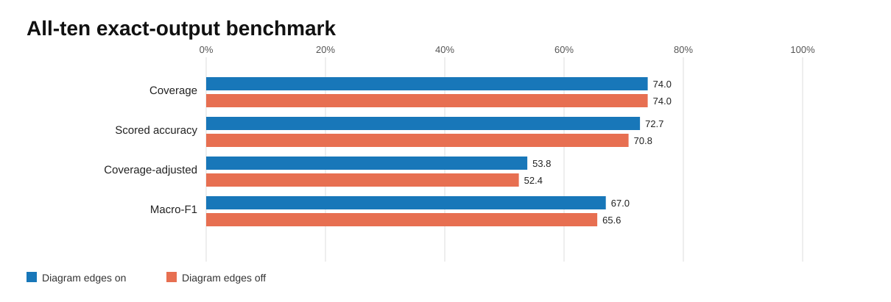
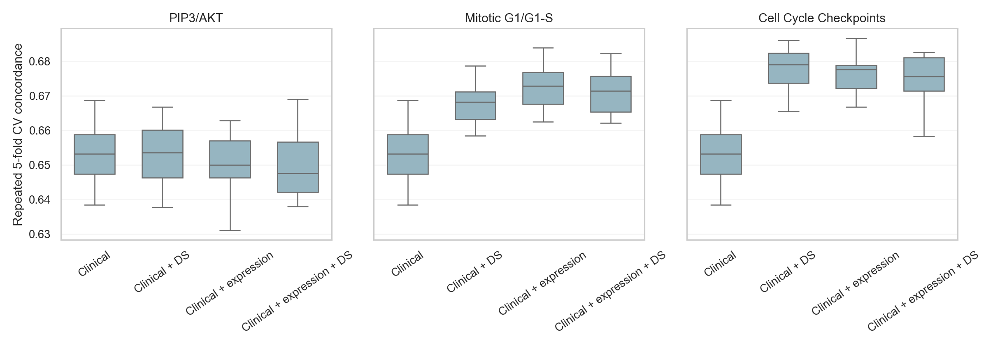
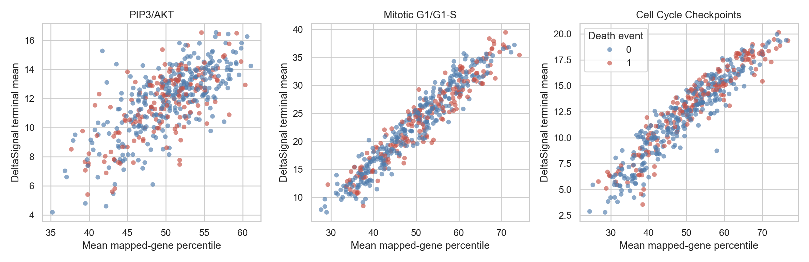
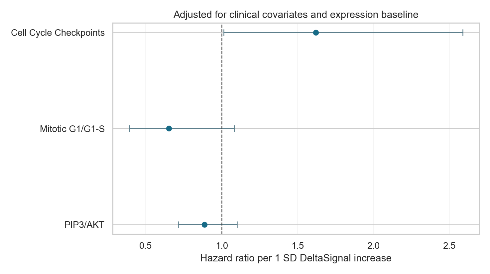
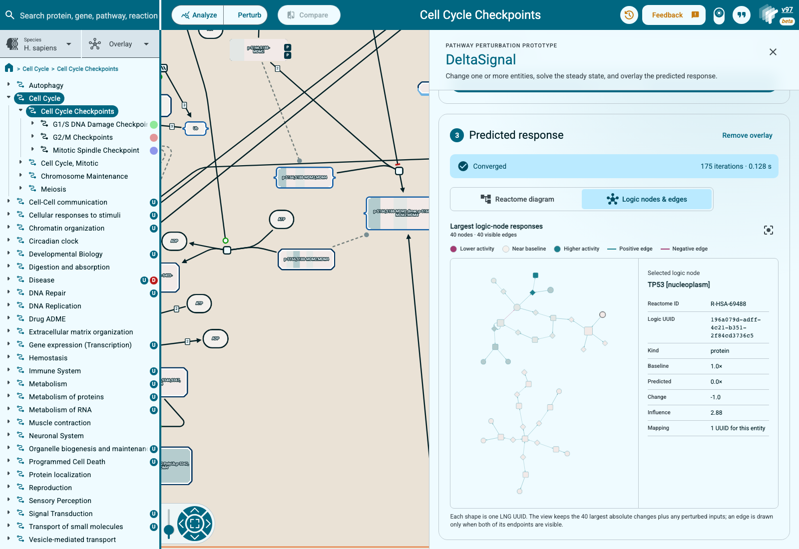

# Evaluating DeltaSignal and bringing perturbation predictions into Reactome

- **GSoC 2026 project:** Improvement of MPBioPath for Reactome Scale
  Perturbation Analysis
- **Contributor:** Chryseis Xinyi Liu
- **Organization:** Open Genome Informatics / Reactome
- **Mentor:** Adam Wright

## What I built

My goal was to make DeltaSignal easier to evaluate and easier to use without
hiding the limitations of the current model. The work has three connected
parts:

1. an auditable perturbation benchmark for DeltaSignal itself;
2. an external TCGA LUAD analysis that asks whether its pathway scores contain
   clinically useful information; and
3. a Reactome Pathway Browser prototype for running and visualizing a
   perturbation interactively.

These parts share the same software stack, but they answer different
questions. The perturbation benchmark is the direct accuracy test. TCGA is an
observational application and control experiment. The browser work is a user
interface. Keeping those claims separate is one of the main conclusions of the
project.

## Code and upstream status

The work is split across three upstream Reactome repositories. This report is
the index for the complete work product; the pull requests remain the best
place to inspect individual code changes and reviews.

| Repository | Contribution | Upstream status |
| --- | --- | --- |
| DeltaSignal | [PR #1: initial TCGA pipeline and preservation of LNG `edge_type`](https://github.com/reactome/deltasignal/pull/1) | Merged |
| Logic Network Generator | [PR #38: stop stringified null identifiers entering UUID mappings](https://github.com/reactome/logic-network-generator/pull/38) | Merged |
| Logic Network Generator | [PR #51: correct Reactome release-version sentinel handling](https://github.com/reactome/logic-network-generator/pull/51) | Merged |
| DeltaSignal | [PR #10: reproducible frozen-network and current-stack benchmarks](https://github.com/reactome/deltasignal/pull/10) | Merged |
| DeltaSignal | [PR #11: held-out ten-pathway evaluation, TCGA matched-expression control, reports, and figures](https://github.com/reactome/deltasignal/pull/11) | Open for review |
| WebsiteAngular | [PR #155: interactive DeltaSignal perturbation UI and logic-network visualization](https://github.com/reactome/WebsiteAngular/pull/155) | Open for review |

The final functional GSoC checkpoints on the two open branches are DeltaSignal
commit [`e0ec076`](https://github.com/reactome/deltasignal/commit/e0ec07630a2e63cb42eaa9a21901ee2833e88ea2)
and WebsiteAngular commit
[`d20ccc2`](https://github.com/reactome/WebsiteAngular/commit/d20ccc2afa0d939937b8465ba99ee0e04fd8a7f7).
Later review or maintenance work can continue on those branches without making
the submitted work-product boundary ambiguous.

## The stack

DeltaSignal does not start from a gene list alone. Its input network is built
from Reactome in two stages:

```text
Reactome pathway
      |
      v
Logic Network Generator (LNG)
      |
      | logic_network.csv
      | stid_to_uuid_mapping.csv
      v
DeltaSignal steady-state solver
      |
      +--> perturbation benchmark
      +--> TCGA pathway scores
      +--> Reactome Pathway Browser overlay
```

LNG expands a Reactome pathway into the logic graph that DeltaSignal solves.
A physical entity can appear in several positions or logical contexts, so one
Reactome stable identifier can map to several LNG UUIDs. Reactions, complexes,
sets, activating and inhibiting edges, and AND/OR relationships are represented
in this generated graph.

DeltaSignal takes observations on one or more UUIDs and propagates them to a
steady state. The result contains a predicted activity and influence score for
each logic node, plus convergence information. A model result therefore
depends on both components:

```text
prediction = DeltaSignal propagation(LNG network, perturbation)
```

This matters for attribution. Regenerating the network can change nodes,
edges, signs, mappings, and positional instances even when the DeltaSignal code
is unchanged. A gain after updating both repositories is an end-to-end gain,
not automatically an improvement to the DeltaSignal algorithm.

## Part 1: perturbation accuracy

### The question

The primary evaluation asks a direct causal question:

> When an experiment increases, decreases, or removes an input, does
> DeltaSignal predict the observed direction of the downstream readout?

This is the best available test of the behavior DeltaSignal is intended to
model. It should not be replaced by survival association, clustering, or how
plausible an overlay looks.

### Cases and held-out design

I used the experimentally supported cases from the MP-BioPath supplementary
workbook. The complete panel contains 847 input, output, and outcome cases from
ten Reactome pathways.

Three pathways were used while developing and checking the harness:

- PIP3 activates AKT signaling;
- Mitotic G1 phase and G1/S transition;
- Cell Cycle Checkpoints.

The other seven pathways were kept as a held-out test set:

- Mitotic Prophase;
- S Phase;
- Signaling by WNT;
- Signaling by ERBB2;
- Transcriptional Regulation by TP53;
- RAF/MAP kinase cascade;
- HDR through HRR or SSA.

The split is fixed in `bench/mpbiopath_ten_pathways.tsv`. It should not be
changed after seeing held-out results.

### What counts as a scored case

The primary endpoint is the exact requested key-output entity. If the
perturbation input or output cannot be mapped into the generated network, the
case is recorded as unscored with an exact reason. It is never silently treated
as an unchanged prediction.

LNG can export an adjacent reaction as a possible readout when the exact entity
is missing. These reaction proxies were disabled for the primary result. A
reaction can be a useful diagnostic fallback, but substituting it changes the
biological question. Mixing exact entities and proxies without reporting the
difference would make coverage look better at the cost of a less clear
endpoint.

### Frozen inputs and recorded provenance

The formal run used:

- Reactome release 97;
- LNG commit `7aca90d03307e53135799a20c2aec75552bec1ba`;
- DeltaSignal/report commit
  `59e1757697300af6e9c90e062c0b32195f7204a7`;
- current propagation with SCC solving;
- stoichiometric weighting disabled;
- separate frozen catalogs with diagram edges enabled and disabled.

The harness records Git state, effective `DS_*` settings, thresholds, input
hashes, network hashes, one row per case, and the complete solver log. It caches
one solve per perturbation because one perturbation can have several evaluated
outputs.

### Main result



| Result | Diagram edges on | Diagram edges off |
| --- | ---: | ---: |
| Eligible experimental cases | 847 | 847 |
| Exact-output cases scored | 627 | 627 |
| Correct scored cases | 456 | 444 |
| Scored-case accuracy | 72.7% | 70.8% |
| Coverage-adjusted accuracy | 53.8% | 52.4% |
| Held-out correct / scored | 289/404 | 280/404 |
| Held-out accuracy | 71.5% | 69.3% |

DeltaSignal scored 627 of 847 cases, which is 74.0% exact-output coverage. With
diagram edges enabled, it was correct on 456 of those 627 cases. With diagram
edges disabled, it was correct on 444.

Across the 627 paired cases, enabling diagram edges changed 25
classifications. Sixteen changed from wrong to correct and four changed from
correct to wrong. The exact paired McNemar p-value was 0.01182. On the seven
held-out pathways, diagram edges produced a net gain of nine correct cases.

This is useful evidence that Reactome diagram topology contributes predictive
signal under the fixed solver. It is not evidence that a DeltaSignal internal
change caused the gain because the ablation changes the LNG-generated graph.

### Pathway-level behavior


The average hides substantial pathway variation. PIP3/AKT was nearly perfect
on the scored subset, while Mitotic G1/G1-S was close to chance. Diagram edges
helped Mitotic G1/G1-S and TP53, slightly hurt Cell Cycle Checkpoints, and made
no classification difference in several other pathways.

That unevenness is important. It argues against describing one aggregate
accuracy as a universal property of the model. Graph structure, mapping
coverage, feedback loops, and the kind of requested readout all vary by
pathway.

### Comparator context

On exactly the 627 cases DeltaSignal could score:

- DeltaSignal was correct on 456/627, or 72.7%;
- MP-BioPath was correct on 452/627, or 72.1%;
- curator predictions were correct on 481/627, or 76.7%.

The paired bootstrap interval for DeltaSignal minus MP-BioPath was -2.7 to
+3.5 percentage points. This supports approximate parity on the mapped subset.
It does not establish a DeltaSignal win.

MP-BioPath and the curator table cover all 847 eligible cases, while
DeltaSignal's exact-output coverage is 627. Counting correct DeltaSignal cases
over all eligible cases gives 53.8% coverage-adjusted accuracy. Both the paired
accuracy and coverage-adjusted number are needed: one describes classification
where the current stack can answer, and the other describes the complete
end-to-end system.

### Coverage failures

The 220 unscored cases were classified as:

- 192 exact outputs missing while an explicit reaction proxy was available;
- 25 gene database identifiers present in Reactome but not exported in the LNG
  network;
- 3 key outputs absent from the Reactome release used for the run.

These are different problems. The first is an endpoint-definition decision,
the second is an LNG export or pathway-boundary problem, and the third is a
release-content limitation. Keeping them separate shows where improvements
would actually have to happen.

### Convergence finding

The diagram-on run marked 133 scored cases as non-converged, but those rows came
from only 9 of 171 unique perturbation solves. A single solve is repeated when
the workbook evaluates several outputs for that perturbation.

All of these failures occurred in Transcriptional Regulation by TP53. Accuracy
among converged diagram-on cases was 340/494, or 68.8%. The non-converged cases
were correct on 116/133, or 87.2%. The high aggregate accuracy is therefore
partly supported by outputs that did not satisfy the numerical convergence
criterion.

I kept those rows as diagnostic results, but they should not be presented as
equally reliable predictions. The immediate solver task is to reproduce and
characterize the nine unique TP53 failures rather than treating 133 repeated
case rows as 133 independent failures.

### Reproduce the benchmark

Install the workbook dependencies:

```sh
python -m pip install -r bench/requirements.txt
```

Run the empirical cases against a generated catalog:

```sh
python bench/benchmark_mpbiopath_cases.py \
  --supplementary-workbook /path/to/SupplementaryTables.xlsx \
  --id-map /path/to/db_id_to_name_mapping.txt \
  --catalog /path/to/lng/output \
  --ground-truth experimental \
  --output-dir /path/to/benchmark-output
```

For the topology ablation, provide separately generated diagram-on and
diagram-off catalogs:

```sh
python bench/run_mpbiopath_factorial.py \
  --catalog release97_diagram_on=/path/to/catalog-diagram-on \
  --catalog release97_diagram_off=/path/to/catalog-diagram-off \
  --supplementary-workbook /path/to/SupplementaryTables.xlsx \
  --id-map /path/to/db_id_to_name_mapping.txt \
  --reactome-id-audit /path/to/reactome_id_audit.tsv \
  --output-dir /path/to/factorial-output
```

Generate the scorecard only after the current-SCC runs finish:

```sh
python bench/generate_evaluation_report.py \
  --diagram-on-dir /path/to/v97-diagram-on-current-scc \
  --diagram-off-dir /path/to/v97-diagram-off-current-scc \
  --tcga-readiness /path/to/readiness_key_findings.tsv \
  --output-dir /path/to/evaluation-report
```

The benchmark details, failure codes, and frozen-network versus current-stack
distinction are documented in [`../bench/README.md`](../bench/README.md).

## Part 2: TCGA LUAD external validation

### The question

The TCGA analysis asks whether patient-specific DeltaSignal pathway scores are
associated with lung adenocarcinoma survival. It does not provide known pathway
perturbations and known downstream responses, so it cannot directly measure
causal perturbation accuracy.

This distinction became especially important after the first Cell Cycle
Checkpoint result looked strong. A clinically associated score can still be a
re-expression of the RNA measurements that were used as its inputs.

### Data and pathway scores

The historical demonstration contains 502 TCGA LUAD tumors. For each tumor,
RNA-seq expression was mapped to observable LNG root nodes. Expression was
converted to a cohort-relative 0 to 100 percentile activity, DeltaSignal was
solved, and terminal node activity was summarized into one score per pathway.

The three pathways were PIP3/AKT, Mitotic G1/G1-S, and Cell Cycle Checkpoints.
The initial median-split result for Cell Cycle Checkpoints was strongly
associated with survival. That result showed that the pipeline ran end to end
and found a biologically plausible proliferation signal. It did not yet show
that network propagation added information.

### What matched expression means

I built a control from the exact genes available to DeltaSignal as inputs for
each pathway:

1. collect the unique mapped input genes;
2. rank each gene's expression from 0 to 100 across the same tumors;
3. average those percentile values for each patient.

The result is a simple expression-only score with the same starting molecular
information but no pathway edges, gates, feedback loops, or steady-state
solver.

Using unique genes is essential. LNG can create many position-aware UUIDs for
one gene. Averaging UUIDs would give duplicated graph contexts extra weight and
would no longer be a fair expression baseline.

### Clinical models

The follow-up analysis used 471 complete cases with 168 deaths. It tested
continuous scores and adjusted for age, sex, pathologic stage, and smoking
history. It also used repeated 5-fold cross-validation over 20 seeded repeats.

The key comparison was held-out concordance for four models:

- clinical covariates only;
- clinical plus DeltaSignal;
- clinical plus matched expression;
- clinical plus both DeltaSignal and matched expression.

The concordance index asks how often the model correctly orders the survival
risk of two comparable patients. A value near 0.5 is no better than random
ordering. Higher is better. Cross-validation matters because in-sample fit can
improve even when a new predictor does not generalize.

### Result



| Pathway | DS/expression Spearman rho | Clinical | + DeltaSignal | + expression | + both |
| --- | ---: | ---: | ---: | ---: | ---: |
| PIP3/AKT | 0.687 | 0.653 | 0.654 | 0.650 | 0.648 |
| Mitotic G1/G1-S | 0.960 | 0.653 | 0.668 | 0.673 | 0.671 |
| Cell Cycle Checkpoints | 0.949 | 0.653 | 0.679 | 0.678 | 0.676 |



For the two cell-cycle pathways, DeltaSignal and matched expression were almost
the same ranking of patients. Cell Cycle Checkpoints had Spearman rho 0.949 and
Mitotic G1/G1-S had rho 0.960. Their cross-validated concordance values were
also nearly identical.

Cell Cycle Checkpoints retained a nominal DeltaSignal coefficient after
adjustment for clinical covariates and matched expression: hazard ratio 1.620,
95% CI 1.014 to 2.589, p=0.0437. The three-pathway false-discovery-rate value
was 0.131. The nested likelihood-ratio p-value for adding DeltaSignal was
0.0397, but adding both scores did not improve held-out concordance over
expression alone.



### What the TCGA result supports

The historical Cell Cycle Checkpoint score captures clinically relevant
cell-cycle variation. DeltaSignal also avoids destroying that signal: its
cross-validated result is close to the matched expression control.

The analysis does not establish incremental predictive value from network
propagation. The simplest explanation is that highly proliferative tumors
already have a strong cell-cycle expression signature, and the deterministic
network mostly preserves that ordering. The static graph does not add enough
independent information to improve survival discrimination in this test.

This is a useful negative result because it defines the next modeling target.
Any learned weights or dynamic model should be compared against matched
expression, not only against clinical covariates or a shuffled-label null. If a
future method cannot beat the same-input expression baseline on held-out data,
its extra mechanistic complexity has not yet earned a predictive claim.

### Reproduce the TCGA analysis

The full data preparation and scoring contract is in
[`../validation/tcga_luad/README.md`](../validation/tcga_luad/README.md).

After a score table has been generated, run the matched-expression and clinical
utility analysis with:

```sh
python validation/tcga_luad/scripts/analyze_clinical_utility.py \
  --activity-tsv /path/to/run/tables/sample_pathway_activity.tsv \
  --clinical-tsv /path/to/TCGA.LUAD.clinicalMatrix.tsv \
  --expression-tsv /path/to/TCGA.LUAD.expression.tsv \
  --root-audit-tsv /path/to/root_observability_audit.tsv \
  --output-dir /path/to/clinical-utility-output
```

The historical result is configuration-specific. It must not be relabeled as a
current LNG or DeltaSignal run without regenerating the networks and scores.

## Part 3: Reactome perturbation interface

### Why add the interface

The benchmark produces tables, but it is difficult to understand one
prediction from a case row alone. The Reactome prototype makes the model
inspectable at the level where a pathway researcher already works.

A user can select a molecule on a Reactome diagram, set it to knockout,
baseline, or activation, run the DeltaSignal API, and inspect the predicted
response without preparing observations by hand.

### Reactome diagram view


The DeltaSignal controls open as a side drawer so that the original pathway
remains visible and interactive. The workflow is:

1. open a pathway with a generated LNG network;
2. choose **Perturb**;
3. select a physical entity on the diagram;
4. set its activity and add the perturbation;
5. add more inputs if needed;
6. run DeltaSignal;
7. check convergence and inspect the response.

Blue diagram elements are predicted below their own baseline, near-white
elements changed little, and red elements are above baseline. If one Reactome
stable identifier maps to several LNG UUIDs, all values are retained and shown
as a gradient rather than silently choosing one value.

The result table is grouped by Reactome stable identifier for readability. It
shows mean activity and change across member UUIDs and the maximum influence
score. The diagram and the new logic view still preserve the individual UUID
results.

### Logic nodes and edges view



Adam suggested a raw nodes-and-edges view as the practical starting point for
showing what LNG produced. This view keeps the 40 UUID-level nodes with the
largest absolute changes, plus every perturbed input. It draws an edge only if
both endpoints are visible.

Each shape is one exact LNG UUID:

- colour shows change from baseline;
- size shows absolute influence;
- an amber border marks a perturbed input;
- node shape distinguishes reactions, complexes or sets, and sequence
  entities;
- edge colour distinguishes positive and negative effects;
- solid and dashed edges distinguish AND and OR relationships.

Selecting a node shows its Reactome stable identifier, UUID, entity type,
baseline, predicted activity, change, influence, and the number of UUIDs that
share its stable identifier. This provides a direct audit of the mapping layer
that was previously visible only in CSV files.

The implementation is on the `feat/deltasignal-ui` branch of
`reactome/WebsiteAngular`. Detailed setup, API behavior, legend definitions,
and verification steps are in
`documentation/PathwayBrowser/deltasignal.md` in that repository.

### What is not in the interface yet

The prototype solves one generated pathway at a time. It does not yet join
several pathway networks or calculate an activity for every ReacFoam region.

A ReacFoam view could become useful for moving from a whole-system overview to
one pathway, but it needs two modeling decisions first:

1. how to aggregate many node activities into one pathway-region score; and
2. how to handle cross-pathway connections and pathways missing from the
   generated catalog.

The meeting discussed ReacFoam as a possibility, not as a finished model
contract. I implemented the exact nodes-and-edges view first because it uses the
graph DeltaSignal already returns and does not invent a new pathway summary.

## Challenges and lessons

The most time-consuming problems were often at the boundaries between tools,
not inside one solver function. LNG mappings are position-aware rather than
one-to-one, missing database identifiers can mean several different things,
and changing the Reactome or LNG release can change a prediction before
DeltaSignal itself runs. The stringified-null and release-sentinel fixes came
from tracing those boundaries rather than skipping malformed rows.

I also learned that evaluation scope changes the apparent conclusion. A paired
comparison on mapped cases can show approximate parity while the complete
system still has limited coverage. Likewise, 133 non-converged case rows can
come from only nine unique solves. Both views are true, but only if the
denominator and unit of analysis are stated.

Finally, a biologically plausible clinical association is not enough to show
that network propagation adds value. The matched-expression control changed
the interpretation of the TCGA result. It showed why every future omics
application should include a baseline built from the same measured inputs.

## What I would do next

The evaluation points to a short list of concrete next steps:

1. Reproduce the nine unique TP53 non-convergent solves and add a convergence
   regression set.
2. Resolve the 25 Reactome-present but LNG-unexported outputs and report any
   resulting coverage gain separately from accuracy.
3. Define a curated output policy for the 192 proxy-available cases rather than
   mixing entity and reaction endpoints after seeing outcomes.
4. Add an external interventional dataset beyond the MP-BioPath workbook.
5. Treat matched expression as a mandatory baseline for every observational
   omics application.
6. Evaluate learned edge or Hill-curve parameters with strict held-out splits.
7. Consider temporal or ODE-based models only where time-resolved data can
   identify the extra parameters.

The current deterministic model is a useful mechanistic baseline. Its paired
perturbation accuracy is approximately comparable with MP-BioPath where exact
readouts are available, and Reactome diagram topology provides a measurable
gain. The remaining limits are also clear: incomplete readout coverage,
pathway-specific numerical failures, and little incremental TCGA survival
signal beyond matched expression. Those limits provide a more useful roadmap
than a single headline accuracy number.
